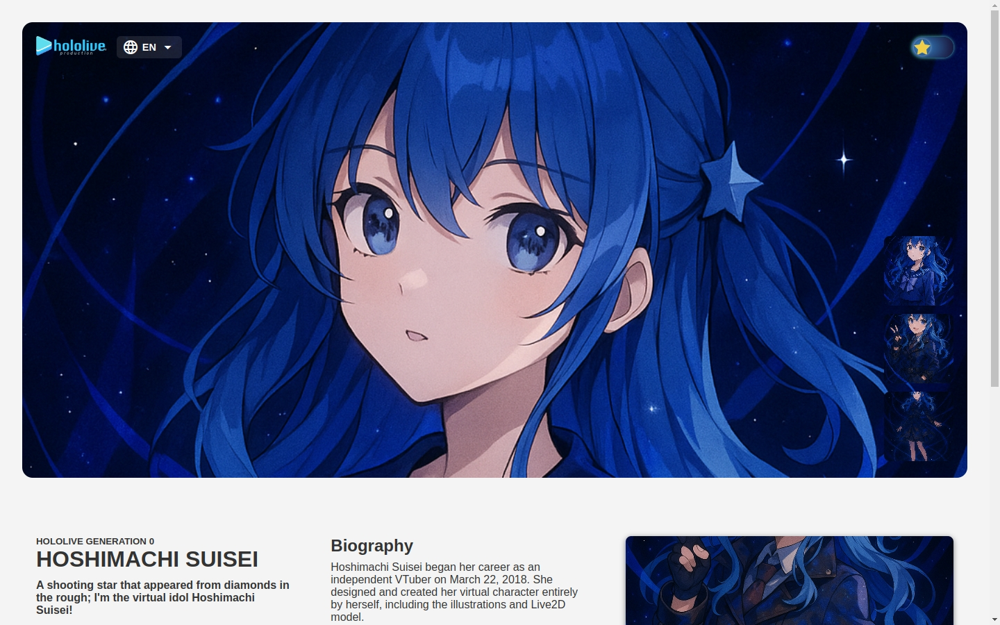

# Suisei Hoshimachi Fan Page

A fan-made responsive website dedicated to Hoshimachi Suisei — a multi-talented virtual idol and member of Hololive Production.

## 🖼️ Screenshot



## About the Project

This project was created as a personal tribute to Hoshimachi Suisei, showcasing his biography, and visuals through a clean, responsive, and accessible web layout. The project serves as a frontend project to demonstrate HTML, CSS, Javascript and design implementation skills while celebrating the beloved VTuber.

## Features

- Responsive layout for mobile and desktop
- Clean UI with sectioned content: About, Biography, and Social Media
- Hover effects and transitions
- Dark Mode
- Images used include AI-generated fan visuals and credits to official illustrations (non-commercial use)

## Technologies Used

- HTML5
- CSS3 (Vanilla)
- Font Awesome (icons)
- Mobile-first design approach

## Image Usage Disclaimer

Some images were AI-generated for aesthetic purposes, while others are from official promotional material. This site is a non-commercial fan project with no intent to infringe on copyrights. All rights to character likeness and artworks belong to Cover Corp and the respective artists.

## How to Run

```bash
# Clone the repository
git clone https://github.com/Adityasputra/suiseiverse-page.git

# Open index.html in your browser
```

## License

This project is for personal and educational use only.
